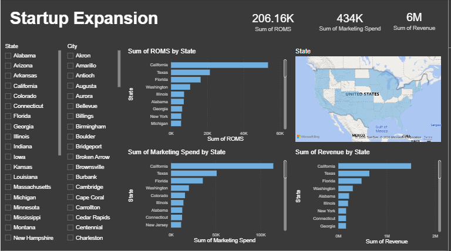

# 📊 Startup Expansion Analysis
## 🧠 Contexte du projet

Ce projet vise à analyser les opportunités d’expansion d’une startup à partir de données business (marché, performance, croissance, zones géographiques, etc.).
L’objectif est d’aider à la prise de décision stratégique en identifiant les marchés les plus prometteurs et les leviers de croissance.

🎯 Objectifs

. Analyser les données de performance de la startup

. Identifier les tendances de croissance

. Comparer les marchés / régions

. Fournir des insights clairs à travers des visualisations

. Proposer une aide à la décision via un dashboard interactif

## 🛠️ Outils & technologies

. Python (Jupyter Notebook)

  . Pandas

. Power BI

## 📈 Analyse des données (Jupyter Notebook)

L’analyse a été réalisée dans Jupyter Notebook et comprend :

 . Nettoyage et préparation des données

 . Analyse exploratoire (EDA)

 . Identification des indicateurs clés (KPI)

Les résultats obtenus ont ensuite été utilisés pour alimenter le dashboard Power BI.
## 📊 Dashboard Power BI

Le dashboard permet de :

. Suivre la croissance par marché

. Comparer les performances par région

. Visualiser les KPI clés de l’expansion

. Faciliter l’analyse pour les décideurs

